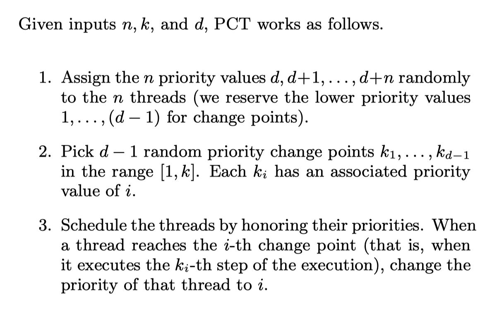

# jpf-cool-jpf-cool-search-strategies

This repo is a series of search strategies. Basic PCT search is implemented

### Install 

- Clone this repo under jpf home.  The recommended structure is:

  - jpf-core
  - jpf-cool-search-strategies
  - ...

- Add `jpf-cool-search-strategies` inside `~/.jpf/site.properties`, eg:

  ```properties
  ...
  jpf-cool-search-strategies = ${jpf.home}/jpf-cool-search-strategies
  extensions+=,${jpf-cool-search-strategies}
  ```

  

- Inside `jpf-cool-search-strategies`, do `ant build`


### Usage

- Inside the `.jpf` file you are trying to run, add 

```properties
@using = jpf-cool-search-strategies
search.class = .search.StatelessPCTSearch
# optional params based on SUT:
search.StatelessPCTSearch.path_limit = ...
search.StatelessPCTSearch.n = ...
search.StatelessPCTSearch.numPrioritySwitchPoints = ...
search.StatelessPCTSearch.maxPrioritySwitchPoints = ...
```

In regards of core `PCT`, here's an excerpt adapted from the reference paper




### Reference

- PCT strategy credit to: [Sebastian Burckhardt, Pravesh Kothari, Madanlal Musuvathi, and Santosh Nagarakatte. A randomized scheduler with probabilistic guarantees of finding bugs.](https://dl.acm.org/citation.cfm?id=1736040)

  

